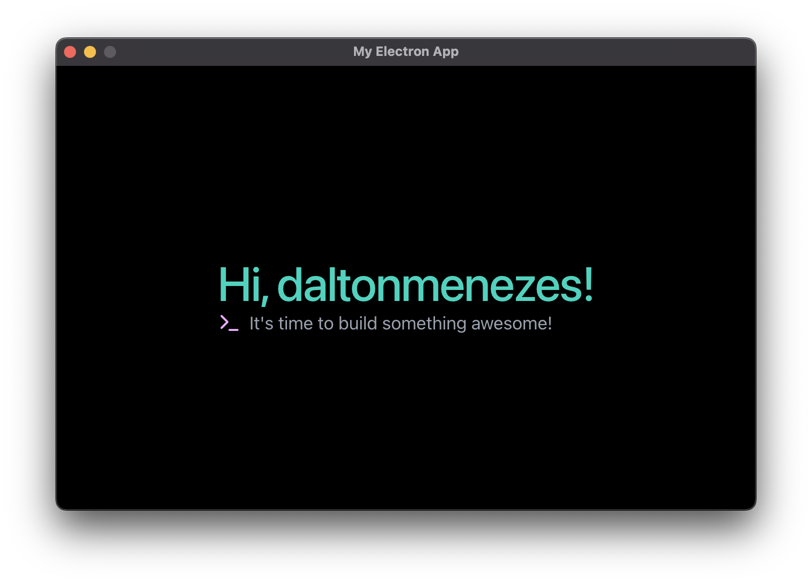

<h1 align="center"> Electron App Template</h1>

<p align="center">An Electron app boilerplate with React v19, TypeScript v5, Tailwind v4, shadcn/ui, Electron Vite, Biome, <strong>GitHub Action releases</strong> and more.
</p>

<p align="center">
  <a href="#electron-app">
    
  </a>
</p>

#  Features
- **Stands out**
  - 🔥 Fast and Ready-to-go with a well-thought-out structure
  - 🚀 Auto reload for main and **Fast Refresh** for renderer process
  - 🎉 Window/Screen routing included
  - 😎 Preload (context bridge) already configured
  - 🔮 GitHub Action releases with `Windows`, `Mac` and `Linux` binaries
  - 🔒 Source Code Protection support
  - 🍪 Absolute paths support
- **Technologies**:
  - 🔋 Electron
  - 🔥 ReactJS v19
  - 🌎 React Router DOM v7 and Electron Router DOM v2
  - 🧐 React Developer Tools
  - 🔍 Code inspector (holding <kbd title="Alt">`Alt`</kbd> or <kbd title="Alt">`Option`</kbd> key on DOM element and clicking on it)
  - 💙 TypeScript v5
  - 📦 Electron Vite
  - ✨ TailwindCSS v4
  - 🎨 shadcn/ui
  - 🍦 lucide-icons
  - 💫 Biome / EditorConfig
  - 📦 Electron Builder
  - 🔮 action-electron-builder

<br/>

> :warning: If **Windows 7** and **8** support is important for your project, you should know that Electron in a version greater than 22x no longer supports it. You can read more about it [here](https://www.electronjs.org/docs/latest/breaking-changes#removed-windows-7--8--81-support). Therefore, you must downgrade Electron to 22x version if it's important for you!

#  Requirements
- [Node.js 20](https://nodejs.org/en/download/)
- [pnpm 10](https://pnpm.io/installation)

#  Installation
```bash
npx degit ndonathan/electron-app-template/template project_name
```
```bash
cd project_name
pnpm install
pnpm dev
```

Now, look at the **package.json** file in the root directory, you should update some of that settings with your project branding.

#  Adding new dependencies
For security reasons, **pnpm** has the [onlyBuiltDependenciesFile](https://pnpm.io/package_json#pnpmonlybuiltdependenciesfile) property where only 
dependencies listed in the [trusted-dependencies-scripts.json](./template/trusted-dependencies-scripts.json) file can perform the postscripts execution. So, if you want to add a new dependency that needs to run a postscript, you should add it to the [trusted-dependencies-scripts.json](./template/trusted-dependencies-scripts.json) file list.

#  Distribution

### For all platforms

> **Note**: Check [Electron Builder docs](https://www.electron.build/cli) for more knowledge

```
pnpm build
```

### For a specific one

```bash
pnpm build --mac
# OR
pnpm build --win
# OR
pnpm build --linux
```

The builded apps will be available in the `dist` folder.

#  Documents
<table>
  <tr>
    <td valign="center">
      <p align="center">
        <a href="https://electron-router-dom.daltonmenezes.com/docs">Routing</a>
      </p>
    </td>
    <td valign="center">
      <p align="center">
        <a href="./docs/STRUCTURE.md">Structure Overview</a>
      </p>
    </td>
    <td valign="center">
      <p align="center">
        <a href="./docs/SOURCE_CODE_PROTECTION.md">Source Code Protection</a>
      </p>
    </td>
    </tr>
    <tr>
    <td valign="center">
      <p align="center">
        <a href="./docs/RELEASING.md">Releasing</a>
      </p>
    </td>
    <td valign="center">
      <p align="center">
        <a href="./docs/UNSIGNED_APPS.md">Running released unsigend apps</a>
      </p>
    </td>
    <td valign="center">
      <p align="center">
        <a href="./docs/FAQ.md">FAQ - Frequently Asked Questions</a>
      </p>
    </td>
  </tr>
</table>


# License

MIT

# Attribution

Based on [Dalton Menezes' Template](https://github.com/daltonmenezes/electron-app/)
